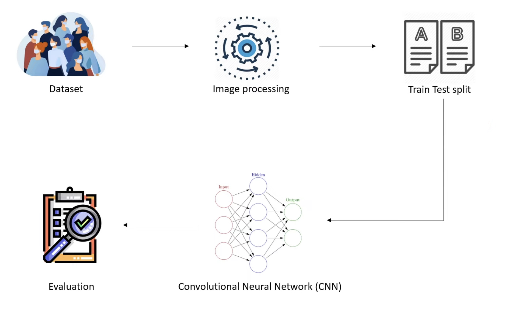

# Mask Detection with Convolutional Neural Network (CNN)

## Project Overview

This repository contains information about a personal Deep Learning project aimed at performing a Convolutional Neural Network (CNN) using Python to detect whether people in images are wearing masks or not. The script has been trained on a dataset of images labeled with and without masks, and it provides a predictive model that can be used to classify new images.

The dataset was collected from **Kaggle**. The dataset is organized into two seperate folders: one for images with masks and another for images without masks. **_The goal of the project was to train a model to classify new images into two classes: people wearing mask or people not wearing mask in the images._**

## Requirements

The following packages are required for this project:

- OS
- NumPy
- Warnings
- Matplotlib
- Tensorflow
- Keras
- Scikit-learn

It is recommended to install these packages using a package manager such as pip or conda. For example, to install these packages from the requirements.txt file using pip, open a terminal or command prompt and run the following command:

    pip install -r requirements.txt

**Note:** Some of these packages may have dependencies that need to be installed as well.

## Project Workflow

**Collect the Dataset:** Collected a dataset of images containing people both with and without masks. Ensured that the dataset is diverse and representative of the scenarios we want to detect masks in.

**Set Memory Growth of GPU Device:**
When using a GPU for training, it's recommended to set the memory growth of the GPU device to ensure **_efficient memory utilization_**. We can achieve this using TensorFlow's GPU memory growth option.

**Check Dataset Balance:** Verified if the dataset is balanced, meaning it contains an equal number of images with masks and without masks. **_A balanced dataset helps the model learn effectively from both classes_**.

**Create Labels for the Image Classes:**
Assigned labels to the images in the dataset. For example, we can use the label "1" for images with masks and "0" for images without masks.

**Check Image Dimensions:**
Ensured that the dimensions of all images in the dataset are the same. This step is crucial to **_maintain consistency during the preprocessing and model training stages_**.

**Image Preprocessing:**
Preprocessed the images to prepare them for model training. Common preprocessing techniques include **_resizing the images to a fixed size_**, **_normalizing pixel values_**, and **_applying any necessary data augmentation techniques_** such as rotation or flipping.

**Train-Test Split:**
Split the dataset into training and testing sets. The training set is used to train the model, while the testing set is used to evaluate its performance. The recommended split is typically around 70-80% for training and 20-30% for testing, but we can adjust this based on the size and specific requirements of our dataset.

**Build the CNN Model:**
Designed and constructed a Convolutional Neural Network (CNN) architecture suitable for mask detection. The architecture includes **_convolutional layers for feature extraction_**, **_pooling layers for downsampling_**, and **_fully connected layers for classification_**.

**Train the Model and Plot Performance:**
Trained the CNN model using the training dataset. During training, monitored the model's performance and tracked metrics such as accuracy, loss. Additionally, plotted these performance metrics using visualization tools like Matplotlib to gain insights into the model's learning progress.

**Evaluate the Model:**
After training, evaluated the model's performance using the testing dataset. Calculated metrics such as accuracy to assess how well the model generalizes to unseen data. This step helps determine the model's effectiveness in detecting masks in the images.

**Design a Predictive System:**
Utilized the trained model to create a predictive system that can classify user-provided images. Developed a Python script that takes the location of an image as input, processes the image using the same preprocessing steps as during training, and applies the trained model to classify whether the person in the image is wearing a mask or not.

## Acknowledgement

You can view the dataset here: [Face Mask Detection Dataset](https://www.kaggle.com/datasets/omkargurav/face-mask-dataset)

## License

**NOT FOR COMMERCIAL USE**

_If you intend to use any of my code for commercial use please contact me and get my permission._

_If you intend to make money using any of my code please get my permission._
